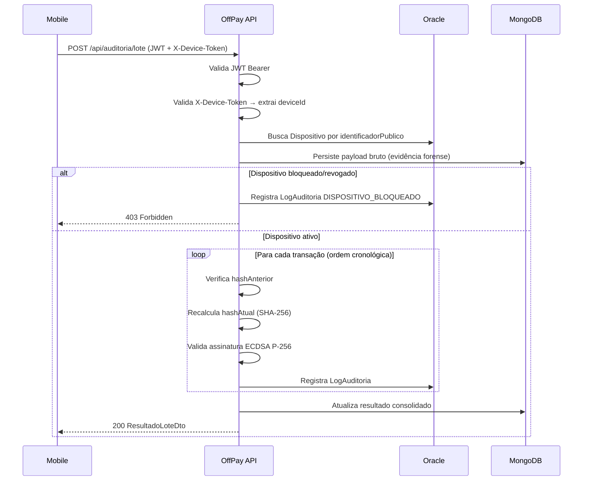

# OffPay — Microsserviço de Auditoria & Compliance

> **FIAP — Global Solution 2026/1 | 2º Ano — Análise e Desenvolvimento de Sistemas**  
> Tema: Economia Espacial

Microsserviço .NET responsável pela **auditoria criptográfica** de transações realizadas offline por pequenos comerciantes, utilizando assinatura digital ECDSA P-256 e hash encadeado para garantia determinística de integridade.

---

## Por que Economia Espacial?

Regiões amazônicas, zonas de desastre e áreas rurais remotas têm sua conectividade viabilizada por infraestrutura satelital (Starlink, Iridium, programas do Disasters Charter). Nesses cenários, a **janela offline não é exceção — é o estado normal de operação**. O OffPay conecta a economia terrestre à infraestrutura espacial de conectividade, permitindo que pequenos comerciantes operem com segurança e auditabilidade mesmo sem internet.

**ODS atendidos:** 8 (Trabalho Decente e Crescimento Econômico), 9 (Indústria, Inovação e Infraestrutura), 11 (Cidades e Comunidades Sustentáveis).

---

## Funcionalidades

- **Gestão de dispositivos** — cadastro, bloqueio remoto e revogação de chaves criptográficas
- **Autenticação dupla** — JWT Bearer (usuário) + Device Token (terminal)
- **Recebimento de lotes** — validação de lotes de transações offline enviados pelo app mobile
- **Assinatura ECDSA P-256** — cada transação é validada contra a chave pública do dispositivo
- **Hash encadeado** — cadeia SHA-256 entre transações, com detecção determinística de adulteração
- **Evidência forense** — payload bruto persistido no MongoDB antes de qualquer validação
- **Auditoria completa** — cada transação gera um `LogAuditoria` com status individual no Oracle

---

## Arquitetura

### Camadas (Clean Architecture)

```
┌─────────────────────────────────────────────┐
│              OffPay.Api                     │
│  Controllers · Middleware · Extensions      │
└───────────────────┬─────────────────────────┘
                    │
        ┌───────────┴───────────┐
        ▼                       ▼
┌───────────────┐     ┌──────────────────────┐
│OffPay.Applic. │     │OffPay.Infrastructure │
│  Use Cases    │     │  Oracle · MongoDB    │
│  DTOs         │     │  ECDSA · JWT         │
│  Abstractions │     └──────────────────────┘
└───────┬───────┘
        │
        ▼
┌───────────────┐
│OffPay.Domain  │
│  Entities     │
│  Enums        │
│  Exceptions   │
└───────────────┘
```

### Fluxo de Validação de Lote



---

## Segurança Criptográfica

### Assinatura Digital ECDSA P-256

Cada transação é assinada no mobile com a chave privada armazenada no hardware seguro (Android Keystore / iOS Secure Enclave). O .NET valida com a chave pública registrada na tabela `DISPOSITIVO`.

- **Algoritmo:** ECDSA com curva P-256 (secp256r1)
- **Hash:** SHA-256
- **Formato da chave pública:** PEM (SubjectPublicKeyInfo)
- **Formato da assinatura:** Base64 — DER/ASN.1 (nativo Android Keystore e iOS Secure Enclave)
- **Conteúdo assinado:** `SHA-256(conteudoCanonico + hashAnterior)`

### Hash Encadeado

```
Transação 1: hashAnterior = "0000...0000" (64 zeros)
             hashAtual    = SHA-256(conteudo₁ + hashAnterior₁ + assinatura₁)

Transação 2: hashAnterior = hashAtual₁
             hashAtual    = SHA-256(conteudo₂ + hashAnterior₂ + assinatura₂)

Transação N: hashAnterior = hashAtual₍ₙ₋₁₎
             ...
```

Qualquer adulteração em uma transação quebra todos os hashes subsequentes — detecção **determinística**, não heurística.

### Status de Validação

| Status | Descrição |
|---|---|
| `Validado` | Assinatura e cadeia de hashes íntegros |
| `AssinaturaInvalida` | Assinatura ECDSA não confere com a chave do dispositivo |
| `HashQuebrado` | hashAnterior ou hashAtual diverge — cascateia para transações seguintes |
| `DispositivoBloqueado` | Dispositivo com status `BLOQUEADO` ou `REVOGADO` |

---

## Stack Técnica

| Camada | Tecnologia |
|---|---|
| Runtime | .NET 8.0 LTS |
| Framework Web | ASP.NET Core 8 — Controllers |
| ORM | Entity Framework Core 8 + Oracle.EntityFrameworkCore |
| Banco Relacional | Oracle Database 21c (Oracle Cloud Free Tier) |
| Banco Documental | MongoDB 7.x (Atlas Free Tier) |
| Autenticação | JWT Bearer (HMAC-SHA256) + Device Token |
| Documentação | Swagger / Swashbuckle.AspNetCore |
| Logging | Serilog (Console + arquivo rotativo diário) |
| Validação | FluentValidation |
| Testes | xUnit + FluentAssertions + Moq |
| Health Checks | AspNetCore.HealthChecks.Oracle + MongoDB customizado |

---

## Pré-requisitos

- [.NET 8.0 SDK](https://dotnet.microsoft.com/download/dotnet/8.0)
- Oracle Database 21c+ (local ou [Oracle Cloud Free Tier](https://www.oracle.com/cloud/free/))
- MongoDB 7.x (local ou [Atlas Free Tier](https://www.mongodb.com/atlas))
- `dotnet-ef`: `dotnet tool install --global dotnet-ef`

---

## Configuração

Edite `src/OffPay.Api/appsettings.json` com os valores reais:

```json
{
  "ConnectionStrings": {
    "Oracle": "Data Source=<host>:1521/<service>;User Id=offpay;Password=<senha>;",
    "MongoDB": "mongodb://<host>:27017"
  },
  "MongoDB": { "Database": "offpay" },
  "Jwt": {
    "Key": "<chave-secreta-minimo-32-caracteres>",
    "Issuer": "offpay-api",
    "Audience": "offpay-clients",
    "ExpiracaoHoras": 8
  },
  "Auth": {
    "AdminUsuario": "admin",
    "AdminSenha": "<senha-do-admin>"
  }
}
```

> **Nunca comite credenciais reais.** Use variáveis de ambiente ou secrets manager em produção.

---

## Como Executar

```bash
# 1. Restaurar dependências
dotnet restore

# 2. Aplicar migrations no Oracle
dotnet ef database update \
  --project src/OffPay.Infrastructure \
  --startup-project src/OffPay.Api

# 3. Executar a API
dotnet run --project src/OffPay.Api
```

Após iniciar:
- **API:** `https://localhost:7000` / `http://localhost:5000`
- **Swagger UI:** `https://localhost:7000/swagger`

### Banco de Dados (DDL manual)

O DDL completo está em [`scripts/script-bd.sql`](scripts/script-bd.sql). Para aplicar manualmente no Oracle SQL*Plus ou DBeaver, execute o conteúdo desse arquivo.

---

## API Reference

### Autenticação

| Método | Endpoint | Auth | Descrição |
|---|---|---|---|
| `POST` | `/api/auth/login` | — | Autentica usuário, retorna JWT |

### Dispositivos

| Método | Endpoint | Auth | Descrição |
|---|---|---|---|
| `POST` | `/api/dispositivos` | JWT admin | Registra dispositivo, retorna Device Token |
| `GET` | `/api/dispositivos` | JWT | Lista dispositivos (paginado, com filtros) |
| `GET` | `/api/dispositivos/{id}` | JWT | Busca dispositivo por identificador público |
| `PATCH` | `/api/dispositivos/{id}/bloqueio` | JWT admin | Bloqueia dispositivo |
| `DELETE` | `/api/dispositivos/{id}/chaves` | JWT admin | Revoga chaves (REVOGADO) |

### Auditoria

| Método | Endpoint | Auth | Descrição |
|---|---|---|---|
| `POST` | `/api/auditoria/lote` | JWT + Device Token | Recebe lote de transações offline |
| `GET` | `/api/auditoria/logs` | JWT | Lista logs de auditoria (paginado, com filtros) |
| `GET` | `/api/auditoria/logs/{id}` | JWT | Busca log de auditoria por ID |

### Health Checks

| Endpoint | Descrição |
|---|---|
| `GET /health` | Status geral da aplicação |
| `GET /health/ready` | Conectividade Oracle + MongoDB |
| `GET /health/live` | Liveness — app em execução |

---

## Exemplos de Uso

Arquivos `.http` para o [REST Client](https://marketplace.visualstudio.com/items?itemName=humao.rest-client) do VS Code:

- [`scripts/exemplos/registrar-dispositivo.http`](scripts/exemplos/registrar-dispositivo.http)
- [`scripts/exemplos/enviar-lote-auditoria.http`](scripts/exemplos/enviar-lote-auditoria.http)

---

## Testes

```bash
# Executar todos os testes
dotnet test

# Com relatório detalhado
dotnet test --logger "console;verbosity=detailed"
```

Os testes de `ServicoCripto` são integração real sem mock — geram pares de chaves ECDSA P-256 em memória e validam assinatura, hash encadeado, adulteração de conteúdo e quebra de cadeia.

---

## Estrutura de Pastas

```
OffPay/
├── src/
│   ├── OffPay.Api/            # Controllers, Middleware, Extensions, Program.cs
│   ├── OffPay.Application/    # Use Cases (CQRS), DTOs, Validators, Abstractions
│   ├── OffPay.Domain/         # Entities, Enums, ValueObjects, Exceptions
│   └── OffPay.Infrastructure/ # EF Core, Oracle, MongoDB, ServicoCripto, Auth
├── tests/
│   └── OffPay.Tests/          # xUnit — ServicoCriptoTests (real, sem mock)
├── scripts/
│   ├── script-bd.sql          # DDL Oracle gerado pelas migrations
│   └── exemplos/              # Arquivos .http para demonstração
├── Directory.Packages.props   # Central Package Management
└── OffPay.sln
```

---

*FIAP Global Solution 2026/1 — 2º Ano ADS*
