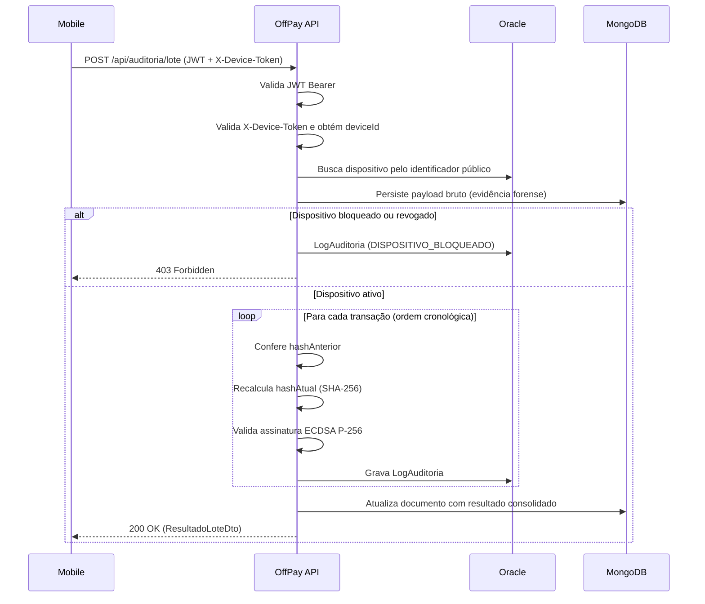

# OffPay – Backend de Auditoria para Pagamentos Offline

Microsserviço construído em **.NET 8** para atuar como **motor de auditoria e compliance** de transações financeiras realizadas sem conexão com a internet.  
O serviço valida lotes de transações usando:

- **Assinatura digital ECDSA P-256**
- **Encadeamento de hashes (SHA-256)**

para garantir **integridade, autenticidade e rastreabilidade** de cada lançamento.

---

## 1. Contexto do Problema

Em regiões de baixa ou nenhuma conectividade: Amazônia, áreas rurais isoladas e zonas de desastre, o acesso à internet costuma depender de infraestrutura espacial (Starlink, Iridium, programas de resposta a desastres etc.). Nesses cenários:

- Estar offline é o **padrão**, não a exceção;
- Pequenos comerciantes precisam continuar operando mesmo sem rede;
- Na posterior sincronização com a nuvem, é necessário **confiar** nos dados enviados.

O OffPay foi pensado como o componente responsável por **auditar** esse fluxo, conectando a operação “off” com a infraestrutura “on” (via satélite/nuvem), garantindo que:

- Os dados não foram adulterados;
- As transações vieram de dispositivos autorizados;
- Existe trilha de auditoria detalhada.

**ODS relacionados ao projeto:**

- ODS 8 — Trabalho Decente e Crescimento Econômico  
- ODS 9 — Indústria, Inovação e Infraestrutura  
- ODS 11 — Cidades e Comunidades Sustentáveis  

---

## 2. O que o OffPay entrega

### 2.1 Gestão de dispositivos

- Registro de terminais (dispositivos) que podem enviar transações;
- Geração de **Device Token** associado ao dispositivo;
- Bloqueio remoto de dispositivos;
- Revogação das chaves criptográficas do terminal.

### 2.2 Segurança e autenticação

- Autenticação de usuário via **JWT Bearer**;
- Autenticação de dispositivo via **Device Token** em header próprio;
- Validação de assinatura digital (ECDSA P-256);
- Cadeia de hashes com SHA-256 para detectar adulterações.

### 2.3 Auditoria de lotes offline

- Recebimento de **lotes de transações** gerados pelo app mobile;
- Processamento das transações em **ordem cronológica**;
- Armazenamento do payload bruto no MongoDB como **evidência forense**;
- Geração de **logs de auditoria** individuais de cada transação no Oracle.

---

## 3. Arquitetura de Software

O projeto segue princípios de **Clean Architecture**, separando responsabilidades em quatro camadas principais:

- **API (OffPay.Api)**  
  - Controllers, middleware, configuração do pipeline HTTP e Swagger.

- **Aplicação (OffPay.Application)**  
  - Casos de uso (CQRS), DTOs, validações (FluentValidation), interfaces.

- **Domínio (OffPay.Domain)**  
  - Entidades, enums, regras de negócio e exceções específicas do domínio.

- **Infraestrutura (OffPay.Infrastructure)**  
  - Repositórios Oracle e MongoDB, implementação do serviço criptográfico, autenticação.

Visão em blocos:

```text
┌────────────────────────────────────────────┐
│                 OffPay.Api                 │
│      Controllers · Middleware · Setup      │
└───────────────────┬────────────────────────┘
                    │
        ┌───────────┴───────────┐
        ▼                       ▼
┌───────────────┐     ┌──────────────────────┐
│OffPay.Applic. │     │OffPay.Infrastructure │
│  Use Cases    │     │  Oracle · MongoDB    │
│  DTOs         │     │  ECDSA · JWT         │
│  Abstractions │     └──────────────────────┘
└───────┬───────┘
        │
        ▼
┌───────────────┐
│OffPay.Domain  │
│  Entities     │
│  Enums        │
│  Exceptions   │
└───────────────┘
```

---

## 4. Como um lote é validado

### 4.1 Passo a passo do fluxo

1. O app mobile envia um lote para `/api/auditoria/lote` com:
   - JWT do usuário;
   - Header `X-Device-Token` do dispositivo;
   - Conteúdo do lote (transações + hashes).

2. A API:
   - Valida o JWT;
   - Valida o Device Token e recupera o `deviceId`;
   - Localiza o dispositivo no Oracle;
   - Salva o payload **sem alterações** no MongoDB.

3. Se o dispositivo estiver bloqueado/revogado:
   - Um `LogAuditoria` com status `DISPOSITIVO_BLOQUEADO` é gravado;
   - A requisição retorna **403 Forbidden**.

4. Se o dispositivo estiver ativo:
   - Cada transação do lote é processada na ordem:
     - Conferência de `hashAnterior`;
     - Recalculo de `hashAtual` com SHA-256;
     - Verificação de assinatura ECDSA P-256;
     - Gravação do `LogAuditoria` (status individual).
   - O documento no MongoDB é atualizado com o **resultado consolidado**;
   - A API devolve um DTO de resultado com o resumo da validação.

### 4.2 Diagrama de sequência (Mermaid)



---

## 5. Criptografia e Integridade

### 5.1 Assinatura digital ECDSA P-256

No dispositivo móvel:

- A chave privada fica em hardware seguro:
  - Android Keystore
  - iOS Secure Enclave
- Cada transação é assinada com ECDSA P-256 (secp256r1) + SHA-256.

No backend:

- A chave pública associada ao dispositivo é armazenada na tabela `DISPOSITIVO`.
- A API valida a assinatura recebida contra a chave pública.

**Especificações:**

- Algoritmo: `ECDSA` (curva `P-256` / `secp256r1`)
- Hash: `SHA-256`
- Chave pública: formato PEM (`SubjectPublicKeyInfo`)
- Assinatura: Base64 de blob DER/ASN.1 (formato nativo Android/iOS)
- Conteúdo assinado (conceitualmente):

  ```text
  SHA-256(conteudoCanonico + hashAnterior)
  ```

### 5.2 Encadeamento de hashes

Cada transação carrega o hash da anterior, formando uma cadeia:

```text
Transação 1:
  hashAnterior = "0000...0000" (64 zeros)
  hashAtual    = SHA-256(conteudo₁ + hashAnterior₁ + assinatura₁)

Transação 2:
  hashAnterior = hashAtual₁
  hashAtual    = SHA-256(conteudo₂ + hashAnterior₂ + assinatura₂)

...

Transação N:
  hashAnterior = hashAtual₍ₙ₋₁₎
  hashAtual    = SHA-256(conteudoₙ + hashAnteriorₙ + assinaturaₙ)
```

Qualquer modificação no meio da sequência **força a quebra da cadeia** dali para frente, sendo detectada de forma determinística.

### 5.3 Estados de validação

Cada transação recebe um dos status abaixo:

| Status                | Quando é aplicado                                                             |
|-----------------------|-------------------------------------------------------------------------------|
| `Validado`            | Assinatura correta e cadeia de hashes íntegra                                |
| `AssinaturaInvalida`  | Assinatura ECDSA falha com a chave pública do dispositivo                    |
| `HashQuebrado`        | Divergência em `hashAnterior` ou `hashAtual`; transações seguintes herdam falha |
| `DispositivoBloqueado`| Dispositivo marcado como `BLOQUEADO` ou `REVOGADO`                           |

---

## 6. Tecnologias Utilizadas

| Componente            | Tecnologia / Versão                                           |
|-----------------------|---------------------------------------------------------------|
| Runtime               | .NET 8.0 LTS                                                 |
| Framework Web         | ASP.NET Core 8 (Controllers)                                 |
| ORM                   | Entity Framework Core 8 + Oracle.EntityFrameworkCore         |
| Banco relacional      | Oracle Database 21c (Oracle Cloud Free Tier)                 |
| Banco documental      | MongoDB 7.x (MongoDB Atlas Free Tier ou local)               |
| Autenticação          | JWT Bearer (HMAC-SHA256) + Device Token                      |
| Documentação          | Swagger / Swashbuckle.AspNetCore                             |
| Logging               | Serilog (console + arquivo rotativo diário)                  |
| Validações            | FluentValidation                                             |
| Testes                | xUnit, FluentAssertions, Moq                                 |
| Health Checks         | AspNetCore.HealthChecks.Oracle + health check custom para MongoDB |

---

## 7. Requisitos para rodar

- [.NET 8.0 SDK](https://dotnet.microsoft.com/download/dotnet/8.0)
- Oracle Database 21c ou superior  
  - Pode ser local ou em [Oracle Cloud Free Tier](https://www.oracle.com/cloud/free/)
- MongoDB 7.x  
  - Local ou em [Atlas Free Tier](https://www.mongodb.com/atlas)
- Ferramenta de migrations do EF Core instalada globalmente:

  ```bash
  dotnet tool install --global dotnet-ef
  ```

---

## 8. Configuração (appsettings)

Arquivo principal de configuração: `src/OffPay.Api/appsettings.json`.

Exemplo:

```json
{
  "ConnectionStrings": {
    "Oracle": "Data Source=<host>:1521/<service>;User Id=offpay;Password=<senha>;",
    "MongoDB": "mongodb://<host>:27017"
  },
  "MongoDB": {
    "Database": "offpay"
  },
  "Jwt": {
    "Key": "<chave-secreta-minimo-32-caracteres>",
    "Issuer": "offpay-api",
    "Audience": "offpay-clients",
    "ExpiracaoHoras": 8
  },
  "Auth": {
    "AdminUsuario": "admin",
    "AdminSenha": "<senha-do-admin>"
  }
}
```

---

## 9. Subindo a aplicação

Na raiz da solução:

```bash
# Restaurar dependências
dotnet restore

# Aplicar migrations no Oracle
dotnet ef database update --project src/OffPay.Infrastructure --startup-project src/OffPay.Api

# Executar a API
dotnet run --project src/OffPay.Api
```

Endereços padrão após subir:

- API: `http://localhost:5267`
- Swagger: `http://localhost:5267/swagger`

### Script SQL (DDL)

O script gerado pelas migrations para criação das tabelas Oracle está em:

```text
scripts/script-bd.sql
```

Pode ser executado manualmente via Oracle SQL Developer ou ferramenta similar.

---

## 10. Cenário de demonstração automatizado

Com a API no ar:

```bash
dotnet run --project scripts/Demo
```

O projeto `scripts/Demo` realiza um fluxo end-to-end:

1. Autentica o administrador (`POST /api/auth/login`);
2. Gera um par de chaves ECDSA P-256 em memória;
3. Registra um dispositivo com a chave pública (`POST /api/dispositivos`);
4. Assina duas transações e envia o lote (`POST /api/auditoria/lote`);
5. Consulta os logs de auditoria no Oracle (`GET /api/auditoria/logs`).

Saída esperada (resumida):

```text
[ 1/5 ] Login como admin...  OK — JWT obtido
[ 2/5 ] Gerando par de chaves...  OK
[ 3/5 ] Registrando dispositivo...  OK — id público: <uuid>
[ 4/5 ] Enviando lote (2 transações)...  OK — 2 validadas, 0 rejeitadas
[ 5/5 ] Consultando logs...  OK — N log(s) encontrados
```

---

## 11. Endpoints principais

### 11.1 Autenticação

| Método | Rota              | Auth | Descrição                 |
|--------|-------------------|------|---------------------------|
| POST   | `/api/auth/login` | —    | Gera JWT para o usuário   |

### 11.2 Dispositivos

| Método | Rota                               | Auth      | O que faz                                      |
|--------|------------------------------------|-----------|-----------------------------------------------|
| POST   | `/api/dispositivos`               | JWT admin | Cadastra dispositivo e retorna Device Token   |
| GET    | `/api/dispositivos`               | JWT       | Lista dispositivos (filtros + paginação)      |
| GET    | `/api/dispositivos/{id}`          | JWT       | Busca dispositivo por identificador público   |
| PATCH  | `/api/dispositivos/{id}/bloqueio` | JWT admin | Bloqueia um dispositivo                       |
| DELETE | `/api/dispositivos/{id}/chaves`   | JWT admin | Revoga chaves do dispositivo (status REVOGADO)|

### 11.3 Auditoria

| Método | Rota                     | Auth                 | O que faz                                       |
|--------|------------------------- |----------------------|-------------------------------------------------|
| POST   | `/api/auditoria/lote`   | JWT + Device Token   | Recebe e valida lote de transações offline      |
| GET    | `/api/auditoria/logs`   | JWT                  | Lista logs de auditoria                         |
| GET    | `/api/auditoria/logs/{id}` | JWT               | Detalha um log de auditoria específico          |

### 11.4 Health checks

| Rota               | Finalidade                                 |
|--------------------|--------------------------------------------|
| `GET /health`      | Status geral da aplicação                  |
| `GET /health/ready`| Verifica conexões com Oracle e MongoDB     |
| `GET /health/live` | Verifica se a aplicação está respondendo   |

---

## 12. Exemplos de requisições (REST Client)

Na pasta `scripts/exemplos` existem arquivos `.http` para uso com o plugin **REST Client** do VS Code:

- `scripts/exemplos/registrar-dispositivo.http`
- `scripts/exemplos/enviar-lote-auditoria.http`

Eles facilitam testar os endpoints diretamente pelo editor.

---

## 13. Testes Automatizados

### 13.1 Rodando os testes

```bash
dotnet test
# ou
dotnet test --logger "console;verbosity=detailed"
```

O projeto de testes (`OffPay.Tests`) possui **38 testes**, organizados em três blocos:

1. **ServicoCriptoTests (9 testes)**  
   - Exercitam o serviço de criptografia “de verdade” (sem mock):
     - Assinatura válida/inválida;
     - Detecção de alteração de conteúdo;
     - `hashAnterior` incorreto;
     - Chave pública errada;
     - Base64 inválido;
     - Determinismo do hash;
     - Encadeamento de múltiplos hashes.

2. **ValidatorsTests (9 testes)**  
   - Validação dos DTOs via FluentValidation:
     - Regras para registro de dispositivo;
     - Regras para bloqueio de dispositivo;
     - Regras para lote de auditoria (incluindo formato de hash).

3. **DispositivoHandlerTests & ReceberLoteHandlerTests (20 testes)**  
   - Casos de uso com repositórios e serviços **mockados**:
     - Registro/bloqueio/revogação de dispositivos;
     - Tratamento de dispositivo ausente ou inativo;
     - Lotes com transações válidas;
     - Assinatura inválida;
     - Hash quebrado, com e sem efeito cascata.

---

## 14. Estrutura do repositório

```text
OffPay/
├── src/
│   ├── OffPay.Api/             # Controllers, middleware, Swagger, Program.cs
│   ├── OffPay.Application/     # Casos de uso, DTOs, validators, abstrações
│   ├── OffPay.Domain/          # Entidades de domínio, enums, exceções
│   └── OffPay.Infrastructure/  # EF Core, Oracle, MongoDB, serviço cripto, auth
├── tests/
│   └── OffPay.Tests/           # xUnit — testes de cripto, validators e handlers
├── scripts/
│   ├── Demo/                   # Demo automático (dotnet run --project scripts/Demo)
│   ├── GerarChave/             # Geração de chaves e transações de teste
│   ├── script-bd.sql           # Script DDL do Oracle
│   └── exemplos/               # Arquivos .http para REST Client (VS Code)
├── Directory.Packages.props    # Centralização de pacotes NuGet
└── OffPay.sln
```
---

## 👥 Integrantes do Grupo

| Nome | RM | Disciplinas |
|---|---|---|
| Arthur Thomas Mariano de Souza | RM 561061 | IoT & IA Generativa, .NET, Mobile |
| Davi Cavalcanti Jorge | RM 559873 | Compliance & Q.A, DevOps, Mobile |
| Mateus da Silveira Lima | RM 559728 | Banco de Dados, Java, Mobile |

Obrigado! :)
---